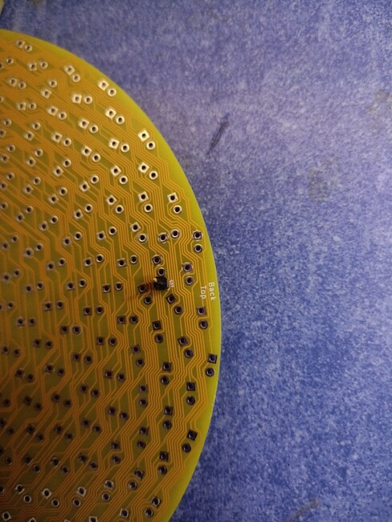

Sunflower PCB Soldering & Assembly Instructions
===============================================

Andy Bennett <andyjpb@ashurst.eu.org>, 2024/08/10

Issues and Limitations
----------------------

+ The first edition driver PCB (the square-ish one) has the incorrect
  footprints for the driver chips. If you choose to use this board then you
  will have to arrange your own wiring for the driver chips. The second edition
  board will have the correct footprints.
+ The first edition driver PCB requires individual DIN and SCLK lines for each
  of the three LED drivers. The second edition board may include provisions for
  multiplexing hardware which will offer DIN, SCLK and three chip select
  lines.
+ On the first edition driver PCB, driving the LED chips and routing power and
  signals to them is left as an exercise for the reader. However, 0.1" headers
  for power and signals are provided. The second edition board may include a
  footprint for an ESP32-C3 Super Mini module.

As the second revision board will fix many of the issues and limitations it is
recommended to wait for it. It will be completely compatible with the round LED
board so you should proceed with building that in the meantime.

Parts needed
------------

+ 1x round sunflower printed circuit board.
+ 1x square(ish) driver printed circuit board.
+ 384x 5mm yellow LEDs (plus a few spares).
+ 3x TM1604 SO-28 LED Driver chips.
+ 3x 0603 SMT 1uF capacitors.
+ 3x 0805 SMT 10uF capacitors.
+ 18x 0.1" headers.
+ 1x Small bolt with a small head.
+ 1x nut for the bolt.
+ 1x washer.
+ 1x spring washer.
+ Enamelled wire (0.15mm or 0.19mm diameter; first edition driver boards only).

Equipment needed
----------------

You will need the following equipment to complete this build:

+ Pliers to separate 0.1" headers.
+ Flush cutters.
+ Soldering iron with spade tip.
+ Solder & soldering tools.
+ IPA (Isopropyl alcohol) for cleaning the boards and removing sharpie marks.
+ Sharpie or equivalent marker pen.
+ Sanding block for fettling LEDs (400 grit works well).
+ ESD / static precautions and equipment when soldering the TM1640 chips.
+ A heated solder sucker is recommended.

Finding the extra inter-board links
-----------------------------------

+ Find "Back Top" on Round Sunflower LED PCB.

+ Find "Front Top" on Square driver PCB.

+ Align PCBs "face-to-face" so that those two markings are sandwiched between
  the PCBs.
+ Poke a bolt through the centre of both PCBS from the round side of the
  sandwich.
+ Hold up to the light & rotate PCB alignment until the holes all line up.

+ Mark each hole on the front of the sunflower PCB with a sharpie.
  + You only need to do the ones that are not part of an LED footprint.
  + These are in the corners of the square PCB and there are 6 of them:
    + 1 top,
    + 1 right,
    + 2 bottom,
    + 2 left.

+ Disassemble the PCBs.
+ The holes you marked should be annotated with a silkscreen marking on the
  back of the round PCB.
  + e.g. "G57".

Soldering the extra inter-board links
-------------------------------------

+ Separate some 0.1" headers and poke the short side of the pin through the
  marked holes from the back of the round PCB.

+ Cut the leg flush with the front of the PCB.

+ Remove the header from the hole and trim the leg a little more.
+ Solder the header in from the front with the smallest amount of solder
  possible so that the joint does not sit proud.

+ Ensure that the pin is absolutely straight and perpendicular to the board.

+ After soldering all 6 headers, the 2 boards should fit together well. Once
  this has been achieved, wash off the sharpie marks with IPA.

Fitting the boards together
---------------------------

+ Slide the boards together and mark the square PCB with sharpie near the holes
  that the header pins slide into. This will assist with reassembly later. Mark
  the holes on both sides of the square PCB.
+ To ensure a good fit, slide the boards together and then wiggle in a rotating
  motion whilst sliding the boards apart. If this is done very carefully it
  will straighten the pins so that they are in the correct place for
  reattachment.
+ Carefully practice sliding the boards together a few times as it will only
  increase in difficulty as more pins are added from the LED legs.

Soldering the LEDs
------------------

+ Set up a jig to test each LED as you fit it. I used a breadboard with 2 wires
  connected to my bench-top power supply which I set up with a 10mA current
  limit.

+ The positive (anode) side of the LED should go into the round hole of the LED
  footprint (marked SEG on the schematic) and the cathode should go into the
  square hole (marked GRID on the schematic). My LEDs have the long leg as the
  anode (SEG) but the flat spot is on the wrong side!
+ Start fitting the LEDs from the centre of the board outwards, paying
  attention to the polarity. When trimming the legs, if the pad is marked with
  silkscreen, leave that leg intact as it forms a connection with the square
  PCB. It's easiest to see the silkscreen markings before you apply the solder.
  Try not to bend these legs! Good Luck! These marks are quite difficult to see
  as they are interrupted by square pads and quite close to round pads.  Sorry!
  I recommend familiarising yourself with the PCB drawing in Kicad and
  practicing identification of the silkscreen marks. I found working under a
  magnifying glass lamp essential.
+ Ensure the LEDs are soldered absolutely square and flush with the board.
+ Trim the interconnecting LED legs slightly to make it easier to distinguish them from the most recently soldered LED and to make the board sandwich easier to assemble.

+ When LEDs do not fit flush with the board due to the position of their neighbours, use the sanding block to fit them. For the LEDs that I had, I found that there are not many of these and most of them were between a third and a half of the way through the soldering.
+ Fit the square board after each leg that connects to it is soldered. This ensures that everything fits and continues to fit.

Soldering the driver PCB
------------------------

+ Once the LEDs are all soldered, test fit the boards together. The boards
  should be close and the 0.1" headers will maintain the distance evenly.

+ Separate the boards again.

+ Solder 3x 0603 SMT 1uF capacitors to the appropriate footprints on the square
  board.
+ Solder 3x 0805 SMT 10uF capacitors to the appropriate footprints on the
  square board.
+ If you are using the first edition square boards, do not fit anything to the
  1206 pads as you will need them later for bodge wires.
+ Solder 6x 2-pin 0.1" headers to the square board. These are the pins that
  provide VCC, GND, DIN and SCLK for each of the LED driver chips.

+ Test fit the round and square boards one more time to ensure everything fits,
  everything is straight and all pins and holes are populated.

+ If all is well, begin soldering the three TM1640 chips. If you are using the
  first edition boards then this is left as an exercise for the reader! The
  first edition boards have an SSOP-28 footprint but SO-28 is required. I
  recommend sticking the chip to the board and then wiring each pin to the
  appropriate PTH pad with enamelled wire 0.15mm or 0.19mm in diameter. Wiring
  between the chip and PTH pad is easier than wiring between the chip and
  SSOP-28 footprint pads, although it does require more wire and some wire
  management hardware.
+ If you are wiring the TM1640 chips by hand, be careful of static. It takes a
  long time and you may want to leave your chair and return several times. This
  can be a hazardous source of unwanted static electricity. I recommend taking
  proper static precautions. Whilst this is important whenever you are handling
  the TM1604 chips, it is especially important when wiring them by hand because
  the risk is greater and the consequences of damaging the chip are severe: it
  is very time consuming and difficult to remove a hand-wired chip!

Testing the boards
------------------

+ It is difficult to test the boards without committing to soldering them
  together.
+ Carefully check the boards with a visual inspection.
+ Spot check a few of the LEDs, by reusing your test-jig configuration, to gain
  confidence that you have soldered them in the correct way around.
+ Fit the boards together.
+ To make it easier to desolder them later, trim all the connecting legs flush
  with the driver PCB.
+ Solder every connecting leg, starting with the inter-board 0.1" header pins.
+ Connect power and signal to each of the chips in turn and try to illuminate
  the LEDs. I used 3.3V power and an OSHCamp2023 ESP8266 badge. If you want to
  use 5V, check the TM1640 datasheet first.

+ If groups of 8 LEDs that are spaced roughly evenly around the board fail to
  light then you probably have a SEG line missing.

+ If groups of 16 LEDs in a spiral pattern fail to light then you probably have a GRID line missing.
+ Use the TM1640 pinout (either from the schematic or the datasheet) along with
  a program that illuminates each row and/or column in turn to debug any
  problematic connections.
+ Good luck!

Good luck with the build! If you have any questions, comments or problems,
please reach out to me using my eMail address above. Enjoy the boards and good
luck with building your sunflowers!

